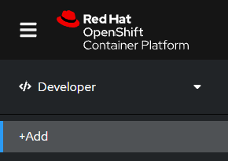
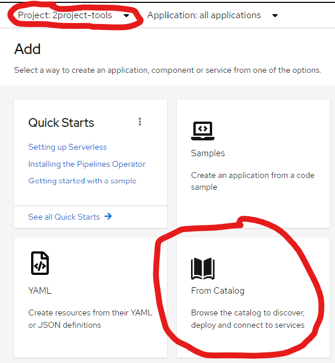
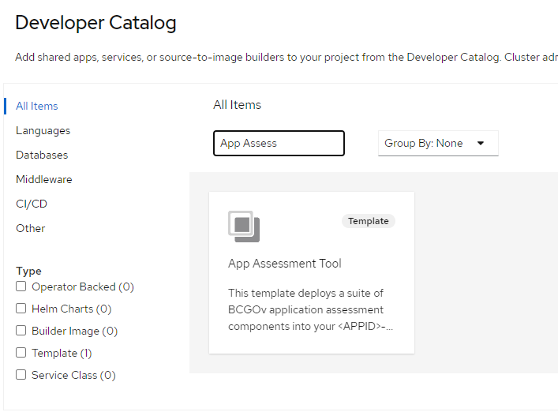
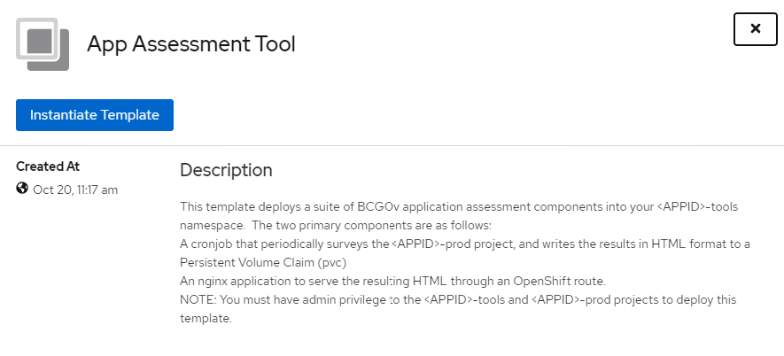
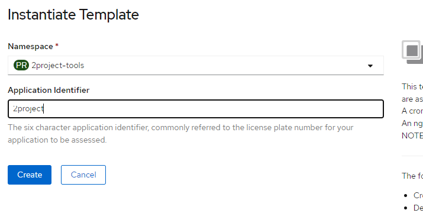

# App Assessment Automation


## Usage


The app assessment components can be deployed through the OpenShift catalog.  The installer must have a minimum of “admin” role in the -prod namespace (for the rolebinding) and “edit” role in the -tools namespace.


From the OpenShift GUI Developer menus, click the +Add button





Ensure you have your -tools namespace selected in the Project field, then click on the “From Catalog” tile





Find the App Assessment template in the catalog:





Click the “App Assessment Tool” tile.


Then click the “Instantiate Template” button:





Finally, the **_six character_** license plate information for your application.  Do not include the -tools or -prod information.  Then click Create.





You will then see the components deployed on the Topology map.


Once the blue ring around NGiNX becomes solid, you can click the 

 to launch the web site.


It is recommended to scale the appassessment-web deployment to zero when it is not in use. 


To remove the components from the projects run the following commands:


```
oc delete all,pvc,serviceaccount,rolebinding -l app=appassessment-app -n ${APPID}-tools
oc delete all,pvc,serviceaccount,rolebinding -l app=appassessment-app -n ${APPID}-prod
```

## 


## Solution Architecture

The following diagram illustrates the architecture components supporting the App Assessment ecosystem.


Namespace (1) components perform the following functions:


* Build the application image, which will be used by the CronJob to scan the -prod namespace workloads and generate a report output as index.html
    * ImageStream contains the metadata of the image created in the BuildConfig build process
    * BuildConfig contains the references supporting the app assessment image build process, based on a Dockerfile in the source repository.  The BuildConfig is currently manually triggered.
    * ServiceAccount is the default builder created in the project (unmodified).
* A Template that appears in the cluster catalog, allowing an Application team user a simple method of deploying the app assessment application into their license plate namespaces.

Namespace (2) describes the components added (bolded lines) to the Application team’s -tool namespace supporting the app assessment application.  The application consists of the following functions:


* A scheduled job written in python that pulls the appropriate data from the -prod namespace, evaluates against BCGov best practices, and generates an index.html file report stored on a persistentvolume.  The job runs against the -prod namespace using the appassessment-sa service account which is given the appropriate role (view) with the RoleBinding in the -prod namespace
    * CronJob runs the appassessment image on a schedule of “0 0 * * 0” which means “at 0:00 on Sunday”
    * ServiceAccount which is used in the CronJob as the serviceAccountName
    * PersistentVolumeClaim mounted writable, which stores the index.html result generated by the python script.
* A simple web portal that presents the generated report to the user.
    * Deployment which starts an nginx-unprivileged container with the PersistentVolumeClaim read-only mounted as /usr/share/nginx/html, which contains the index.html report generated by the CronJob
    * Service defines the pod selector used by the Route
    * Route exposes the web server to the Application team

Namespace (3) describes the components added (bolded lines) to the Application team’s -prod namespace supporting the app assessment application.  This provides the following functions:


* Provides the appropriate permissions to the ServiceAccount for the CronJob to collect the data from the namespace.
    * RoleBinding maps the ServiceAccount appassessment-svc in the -tools namespace with the “view” ClusterRole
* This namespace also contains the Application Teams workloads that will be assessed.


## 


## Source Repositories

The primary repository for this work is here:

[https://github.com/bcgov/AppAssessment](https://github.com/bcgov/AppAssessment/)

The repository is split into three folders:


    **build** - Artifacts required to support the app assessment image build process


    **deploy** - Examples of artifacts created by the template to deploy the application in a namespace “1test-tools” which will scan the application namespace “1test-prod”.  This source should not be used to deploy the application.


    **template** - OpenShift Template supporting the catalog item, which will deploy the application components to the appropriate namespaces.


    **images** - Images for this readme.md file

The repository includes [GitHub Issues](https://github.com/bcgov/AppAssessment/issues) to track future work to the project.


### Python code

Arctiq development of report.py and checks.py was originally developed and maintained here:

[https://github.com/ArctiqTeam/p-bcgov/tree/reporting/reporting](https://github.com/ArctiqTeam/p-bcgov/tree/reporting/reporting)

Continued development of the report.py and checks.py should be maintained here:

[https://github.com/bcgov/AppAssessment/tree/main/build](https://github.com/bcgov/AppAssessment/tree/main/build)
