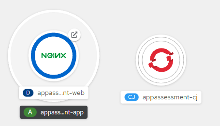
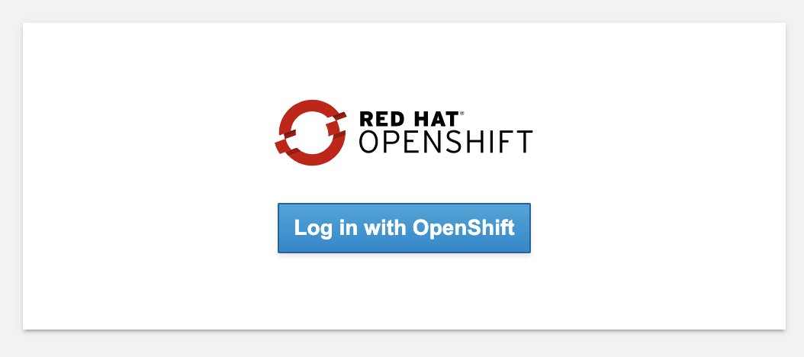
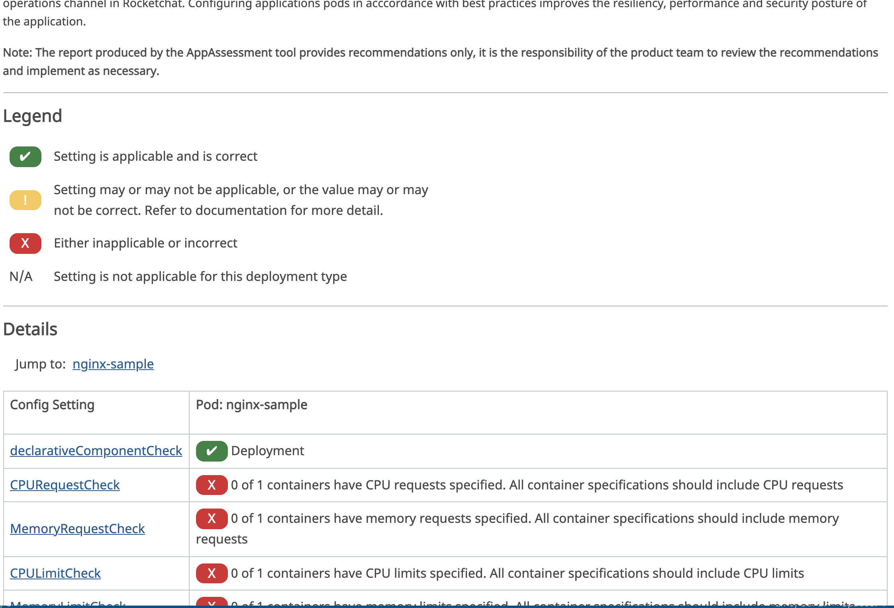
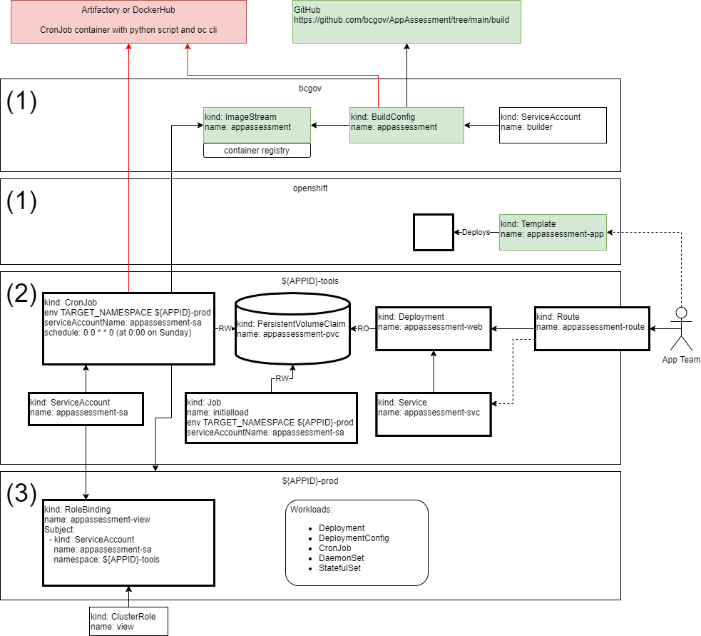

# App Assessment Automation


## Usage

To install the AppAssessment utility in your namespace, use the command terminal. Login to your project namespace and use the following commmand to install:

```
oc process -f https://raw.githubusercontent.com/bcgov/AppAssessment/main/template/appassessment-template.yaml -p LICENSE_PLATE=<License Plate> -p CLUSTER_NAME="<Cluster Name>" -p APP_ASSESSMENT_IMAGE=image-registry.openshift-image-registry.svc:5000/bcgov/app-assessment | oc apply -f -
```

\<License Plate\> must be replaced by the **_six character_** license plate information for your application. Do not include the -tools or -prod information as part of this parameter.

 \<Cluster Name\> must be the user-friendly name of the cluster, like "Kamloops-Silver". **_Please note that at the moment cluster names with spaces are not supported_**. This is an issue with how the paramters are read by the python script, and hopefully will be fixed soon. For now, please use dashes.

 By default, **_the report will be generated against pods in your prod namespace_**, i.e. "abc123-prod". If you require testing against another namespace, an additional parameter can be added to the command above: 

 ```
 -p TARGET=<namespace>
 ```
 where \<namespace> is "dev", or "test", or whatever you require. 

Once you run the command, you should see the components deployed on the Topology map.





Once the blue ring around NGiNX becomes solid, you can click the 

 to launch the web site.

 To manually update the report and index.html run the following command, replacing the ${APPID} string with your application license plate:


```
oc create job --from=cronjob/appassessment-cj manualupdate -n ${APPID}-tools
```

The AppAssessment utility has authorization handled by OAuth Proxy (https://github.com/openshift/oauth-proxy), and users will be required to authorize before viewing reports. 


###### Example Output:


It is recommended to scale the appassessment-web deployment to zero, or remove the components when it is not in use.


To scale to zero, run the following command, replacing the ${APPID} string with your application license plate:


```
oc scale deployment/appassessment-web --replicas 0 -n ${APPID}-tools
```


To remove the components from the projects run the following commands, replacing the ${APPID} string with your application license plate:


```
oc delete all,pvc,serviceaccount,rolebinding -l app=appassessment-app -n ${APPID}-tools
oc delete all,pvc,serviceaccount,rolebinding -l app=appassessment-app -n ${APPID}-prod
```


## 


## Solution Architecture

The following diagram illustrates the architecture components supporting the App Assessment ecosystem.





Namespace (1) components perform the following functions:


* Build the application image, which will be used by the CronJob to scan the -prod namespace workloads and generate a report output as index.html
    * ImageStream contains the metadata of the image created in the BuildConfig build process
    * BuildConfig contains the references supporting the app assessment image build process, based on a Dockerfile in the source repository.  The BuildConfig is currently manually triggered.
    * ServiceAccount is the default builder created in the project (unmodified).
* The AppAssessment Template in the openshift namespace that appears in the cluster catalog, allowing an Application team user a simple method of deploying the app assessment application into their license plate namespaces.

Namespace (2) describes the components added (bolded lines) to the Application team’s -tool namespace supporting the app assessment application.  The application consists of the following functions:


* A scheduled job written in python that pulls the appropriate data from the -prod namespace, evaluates against BCGov best practices, and generates an index.html file report stored on a persistentvolume.  The job runs against the -prod namespace using the appassessment-sa service account which is given the appropriate role (view) with the RoleBinding in the -prod namespace
    * CronJob runs the appassessment image on a schedule of “0 0 * * 0” which means “at 0:00 on Sunday”
    * ServiceAccount which is used in the CronJob as the serviceAccountName
    * PersistentVolumeClaim mounted writable, which stores the index.html result generated by the python script.
* A simple web portal that presents the generated report to the user.
    * Deployment which starts an nginx-unprivileged container with the PersistentVolumeClaim read-only mounted as /usr/share/nginx/html, which contains the index.html report generated by the CronJob
    * Service defines the pod selector used by the Route
    * Route exposes the web server to the Application team

Namespace (3) describes the components added (bolded lines) to the Application team’s -prod namespace supporting the app assessment application.  This provides the following functions:


* Provides the appropriate permissions to the ServiceAccount for the CronJob to collect the data from the namespace.
    * RoleBinding maps the ServiceAccount appassessment-svc in the -tools namespace with the “view” ClusterRole
* This namespace also contains the Application Teams workloads that will be assessed.


## 


## Source Repositories

The primary repository for this work is here:

[https://github.com/bcgov/AppAssessment](https://github.com/bcgov/AppAssessment/)

The repository is split into three folders:


    **build** - Artifacts required to support the app assessment image build process


    **deploy** - Examples of artifacts created by the template to deploy the application in a namespace “1test-tools” which will scan the application namespace “1test-prod”.  This source should not be used to deploy the application.


    **template** - OpenShift Template supporting the catalog item, which will deploy the application components to the appropriate namespaces.


    **images** - Images for this readme.md file

The repository includes [GitHub Issues](https://github.com/bcgov/AppAssessment/issues) to track future work to the project.


### Python code

Arctiq development of report.py and checks.py was originally developed and maintained here:

[https://github.com/ArctiqTeam/p-bcgov/tree/reporting/reporting](https://github.com/ArctiqTeam/p-bcgov/tree/reporting/reporting)

Continued development of the report.py and checks.py should be maintained here:

[https://github.com/bcgov/AppAssessment/tree/main/build](https://github.com/bcgov/AppAssessment/tree/main/build)

### What checks are done?
The checks are mostly concerned with whether or not best practices are being followed in terms of service reliability and resource use. 

#### Declarative Component 
Checks that a declarative approach to deployment has been used. The workload is using either a Deployment(Config), StatefulSet, DaemonSet, or CronJob
https://docs.openshift.com/container-platform/4.9/applications/deployments/what-deployments-are.html      
#### CPU Request 
The CPU request represents a minimum amount of CPU that your container may consume, but if there is no contention for CPU, it can use all available CPU on the node. If there is CPU contention on the node, CPU requests provide a relative weight across all containers on the system for how much CPU time the container may use.
https://docs.openshift.com/online/pro/dev_guide/compute_resources.html#dev-cpu-requests

#### Memory Request
By default, a container is able to consume as much memory on the node as possible. In order to improve placement of pods in the cluster, specify the amount of memory required for a container to run. The scheduler will then take available node memory capacity into account prior to binding your pod to a node. A container is still able to consume as much memory on the node as possible even when specifying a request.
https://docs.openshift.com/online/pro/dev_guide/compute_resources.html#dev-memory-requests

#### CPU Limit
Each container in a pod can specify the amount of CPU it is limited to use on a node. CPU limits control the maximum amount of CPU that your container may use independent of contention on the node. If a container attempts to exceed the specified limit, the system will throttle the container. This allows the container to have a consistent level of service independent of the number of pods scheduled to the node.",
https://docs.openshift.com/online/pro/dev_guide/compute_resources.html#dev-cpu-limits
#### Memory Limit
If you specify a memory limit, you can constrain the amount of memory the container can use. For example, if you specify a limit of 200Mi, a container will be limited to using that amount of memory on the node. If the container exceeds the specified memory limit, it will be terminated and potentially restarted dependent upon the container restart policy.
https://docs.openshift.com/online/pro/dev_guide/compute_resources.html#dev-memory-limits

#### Liveness Probe 
A liveness probe determines if a container is still running. If the liveness probe fails due to a condition such as a deadlock, the kubelet kills the container. The pod then responds based on its restart policy.
https://docs.openshift.com/container-platform/4.9/applications/application-health.html#application-health-about_application-health

#### Readiness Probe
A readiness probe determines if a container is ready to accept service requests. If the readiness probe fails for a container, the kubelet removes the pod from the list of available service endpoints.
https://docs.openshift.com/container-platform/4.9/applications/application-health.html#application-health-about_application-health
